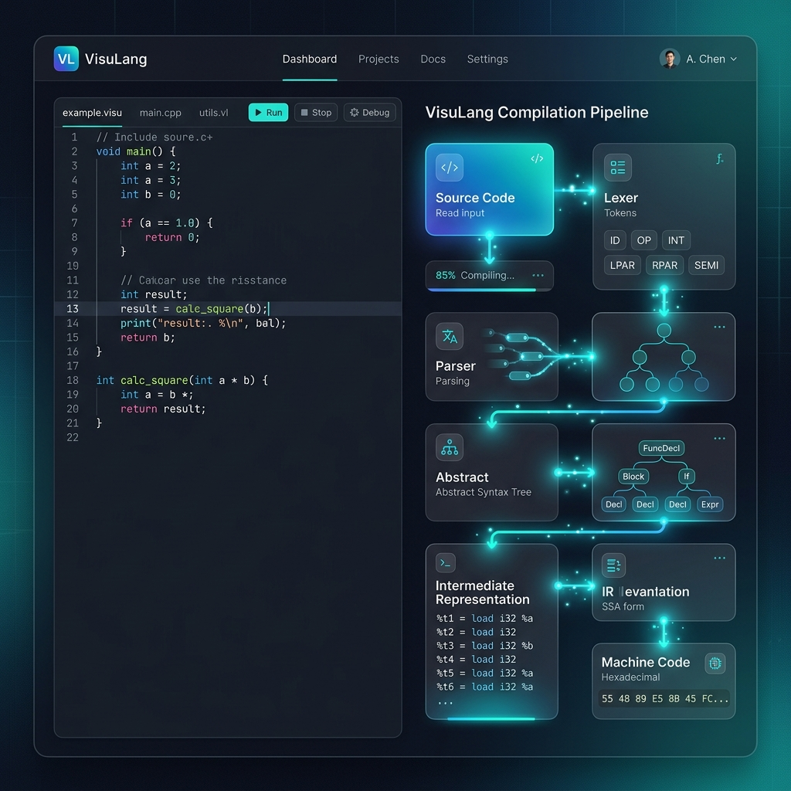

# VisuLang: Interactive MiniLang Compiler

VisuLang is a visual education platform designed to demystify the inner workings of modern compilers. By providing a step-by-step visualization of the compilation pipeline, from Lexical Analysis to Machine Code generation, VisuLang helps students and developers understand how code is transformed and executed.



## Live Demo

A web-based interactive playground is available to test the compilation pipeline directly in your browser:
[Access the VisuLang Web Playground](https://hadi-mostafa-27.github.io/VisuLang-a-visual-compiler-prototype-/)

## Key Features

- **Live Pipeline Visualization**: Observe code as it flows through the Lexer, Parser, Semantic Analyzer, and Code Generator.
- **Interactive Playground**: Write MiniLang code and view immediate results within the web dashboard.
- **AST Exploration**: Visualize the Abstract Syntax Tree generated from the source code.
- **Machine Code Generation**: Observe how high-level logic translates into low-level instructions.
- **Integrated Interpreter**: Run the code directly in the environment and review the execution trace.

## Compilation Pipeline

1. **Source**: Raw MiniLang code input.
2. **Lexer**: Converts source code into a stream of tokens.
3. **Parser**: Builds an Abstract Syntax Tree (AST) following MiniLang grammar.
4. **Semantic Analysis**: Performs type checking and symbol table management.
5. **IR Generation**: Produces Intermediate Representation (3-Address Code).
6. **Optimizer**: Applies constant folding and dead code elimination.
7. **Machine Code**: Lowers IR to simulated target assembly.
8. **Interpreter**: Executes the code and provides program output.

## Local Development (Python GUI)

While the web playground provides an accessible overview, the full-featured desktop application offers advanced debugging tools and deeper system integration.

### Prerequisites
- Python 3.10+
- PySide6

### Setup
```bash
# Clone the repository
git clone https://github.com/hadi-mostafa-27/VisuLang-a-visual-compiler-prototype-.git

# Install dependencies
pip install -r requirements.txt

# Run the GUI
python MiniLangCompiler/gui.py
```

## Project Status

This is strictly an educational project developed for academic and learning purposes. It serves as a prototype to demonstrate fundamental compiler construction principles and should not be used in production environments.
